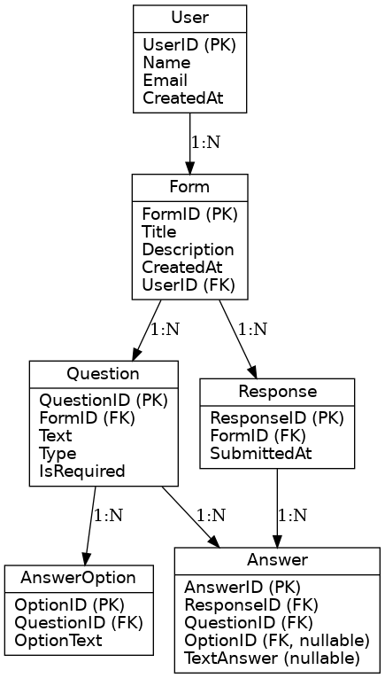

Ось повноцінне рішення у форматі **Markdown** для завдання зі створення бізнес-моделі та ER-діаграми системи опитувань, аналогічної до Google Forms.

---

# 📊 Бізнес-модель для системи опитувань

| Об’єкт         | Атрибут             | Тип даних       | Приклад                                 | Обмеження                |
|----------------|---------------------|------------------|------------------------------------------|--------------------------|
| User           | UserID              | INT (PK)         | 101                                      | Обов’язкове, автогенерація |
|                | Name                | VARCHAR(100)     | "Іван Петренко"                          | Обов’язкове              |
|                | Email               | VARCHAR(255)     | "ivan@example.com"                       | Унікальне, обов’язкове   |
|                | CreatedAt           | DATETIME         | 2025-04-10 09:30:00                      | Обов’язкове              |
| Form           | FormID              | INT (PK)         | 1001                                     | Обов’язкове, автогенерація |
|                | Title               | VARCHAR(255)     | "Опитування про харчування"             | Обов’язкове              |
|                | Description         | TEXT             | "Ми досліджуємо харчові звички..."      | Необов’язкове            |
|                | CreatedAt           | DATETIME         | 2025-04-10 10:00:00                      | Обов’язкове              |
|                | UserID              | INT (FK)         | 101                                      | Обов’язкове              |
| Question       | QuestionID          | INT (PK)         | 2001                                     | Обов’язкове, автогенерація |
|                | FormID              | INT (FK)         | 1001                                     | Обов’язкове              |
|                | Text                | TEXT             | "Які фрукти ви їсте найчастіше?"        | Обов’язкове              |
|                | Type                | ENUM             | "text", "multiple_choice", "checkbox"   | Обов’язкове              |
|                | IsRequired          | BOOLEAN          | TRUE                                     | За замовчуванням FALSE   |
| AnswerOption   | OptionID            | INT (PK)         | 3001                                     | Обов’язкове              |
|                | QuestionID          | INT (FK)         | 2001                                     | Обов’язкове              |
|                | OptionText          | VARCHAR(255)     | "Яблука"                                 | Обов’язкове              |
| Response       | ResponseID          | INT (PK)         | 4001                                     | Обов’язкове              |
|                | FormID              | INT (FK)         | 1001                                     | Обов’язкове              |
|                | SubmittedAt         | DATETIME         | 2025-04-10 11:00:00                      | Обов’язкове              |
| Answer         | AnswerID            | INT (PK)         | 5001                                     | Обов’язкове              |
|                | ResponseID          | INT (FK)         | 4001                                     | Обов’язкове              |
|                | QuestionID          | INT (FK)         | 2001                                     | Обов’язкове              |
|                | OptionID            | INT (FK, NULL)   | 3001                                     | NULL, якщо текстове      |
|                | TextAnswer          | TEXT (NULL)      | "Банани"                                 | NULL, якщо з варіантами  |

---

### 🔄 Взаємодія об’єктів:

1. **Користувач** створює **Форму**.
2. У межах форми додає **Питання**.
3. Для типів з вибором додає **Варіанти відповідей**.
4. **Учасники** заповнюють форму → зберігається **Response**.
5. Кожна відповідь зберігається в таблиці **Answer** — або з `OptionID`, або з `TextAnswer`.

---

# 🧩 ER-діаграма

# 📋 Чекліст ✅

- ✅ Всі об’єкти системи визначені
- ✅ Типи даних конкретні (VARCHAR, INT, ENUM)
- ✅ Є позначення первинних та зовнішніх ключів
- ✅ Логічні зв’язки між сутностями
- ✅ Взаємодія об’єктів пояснена

---

