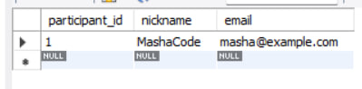

# Реалізація об’єктно-реляційного відображення

## 1. Створення бази даних MySQL

Створено базу даних `questboard` за допомогою MySQL для зберігання даних.

```
CREATE DATABASE questboard;
USE questboard;

CREATE TABLE quests (
  quest_id INT PRIMARY KEY AUTO_INCREMENT,
  title VARCHAR(255),
  description TEXT
);

CREATE TABLE prompts (
  prompt_id INT PRIMARY KEY AUTO_INCREMENT,
  quest_id INT,
  text TEXT,
  FOREIGN KEY (quest_id) REFERENCES quests(quest_id)
);

CREATE TABLE participants (
  participant_id INT PRIMARY KEY AUTO_INCREMENT,
  nickname VARCHAR(100),
  email VARCHAR(100)
);

CREATE TABLE replies (
  reply_id INT PRIMARY KEY AUTO_INCREMENT,
  prompt_id INT,
  participant_id INT,
  response TEXT,
  FOREIGN KEY (prompt_id) REFERENCES prompts(prompt_id),
  FOREIGN KEY (participant_id) REFERENCES participants(participant_id)
);
```


## 2. Створення Java-проєкту

Для реалізації завдання створено консольний Java-проєкт.

**Структура проєкту:**

```
questboard/
├── src/
│   ├── entity/         # класи-моделі таблиць
│   ├── repository/     # DAO-класи
│   └── demo/           # тестування
````


## 3. Створення bean-класів

**Створено клас Quest.java**

```java
package entity;

public class Quest {
    private int questId;
    private String title;
    private String description;

    public Quest(int questId, String title, String description) {
        this.questId = questId;
        this.title = title;
        this.description = description;
    }

    public int getQuestId() { return questId; }
    public String getTitle() { return title; }
    public String getDescription() { return description; }

    public void setQuestId(int questId) { this.questId = questId; }
    public void setTitle(String title) { this.title = title; }
    public void setDescription(String description) { this.description = description; }
}
```

**Створено клас Participant.java**

```java
package entity;

public class Participant {
    private int participantId;
    private String nickname;
    private String email;

    public Participant(int participantId, String nickname, String email) {
        this.participantId = participantId;
        this.nickname = nickname;
        this.email = email;
    }

    public int getParticipantId() { return participantId; }
    public String getNickname() { return nickname; }
    public String getEmail() { return email; }

    public void setParticipantId(int participantId) { this.participantId = participantId; }
    public void setNickname(String nickname) { this.nickname = nickname; }
    public void setEmail(String email) { this.email = email; }
}
```


## 4. Створення DAO-класів

**Було створено QuestRepository.java**

```java
package repository;

import entity.Quest;
import java.sql.*;

public class QuestRepository {
    private Connection conn;

    public QuestRepository(Connection conn) {
        this.conn = conn;
    }

    public void save(Quest quest) throws SQLException {
        String sql = "INSERT INTO quests (title, description) VALUES (?, ?)";
        PreparedStatement stmt = conn.prepareStatement(sql);
        stmt.setString(1, quest.getTitle());
        stmt.setString(2, quest.getDescription());
        stmt.executeUpdate();
    }
}
```

**Було створено ParticipantRepository.java**

```java
package repository;

import entity.Participant;
import java.sql.*;
import java.util.*;

public class ParticipantRepository {
    private Connection conn;

    public ParticipantRepository(Connection conn) {
        this.conn = conn;
    }

    public void save(Participant participant) throws SQLException {
        String sql = "INSERT INTO participants (nickname, email) VALUES (?, ?)";
        PreparedStatement stmt = conn.prepareStatement(sql);
        stmt.setString(1, participant.getNickname());
        stmt.setString(2, participant.getEmail());
        stmt.executeUpdate();
    }

    public List<Participant> findByNickname(String nickname) throws SQLException {
        List<Participant> list = new ArrayList<>();
        String sql = "SELECT * FROM participants WHERE nickname = ?";
        PreparedStatement stmt = conn.prepareStatement(sql);
        stmt.setString(1, nickname);
        ResultSet rs = stmt.executeQuery();

        while (rs.next()) {
            list.add(new Participant(
                rs.getInt("participant_id"),
                rs.getString("nickname"),
                rs.getString("email")
            ));
        }
        return list;
    }
}
```

## 6. Тестування

**Було створено тестовий клас TestQuestBoard.java**

```
package demo;

import repository.*;
import entity.*;
import java.sql.*;
import java.util.*;

public class TestQuestBoard {
    public static void main(String[] args) {
        String url = "jdbc:mysql://localhost:3306/questboard";
        String user = "root";
        String password = "your_password"; // змінити

        try (Connection conn = DriverManager.getConnection(url, user, password)) {
            QuestRepository questRepo = new QuestRepository(conn);
            ParticipantRepository participantRepo = new ParticipantRepository(conn);

            questRepo.save(new Quest(0, "Форма реєстрації на хакатон", "Збір базових даних для участі."));
            participantRepo.save(new Participant(0, "AndriiDev", "andrii@example.com"));
            participantRepo.save(new Participant(0, "MashaCode", "masha@example.com"));

            List<Participant> result = participantRepo.findByNickname("MashaCode");
            for (Participant p : result) {
                System.out.println("Знайдено: " + p.getNickname() + ", " + p.getEmail());
            }

        } catch (SQLException e) {
            e.printStackTrace();
        }
    }
}
```


## 7. Компіляція та запуск

**Компіляція:**

```bash
javac -cp "lib/mysql-connector-j-<version>.jar" src/**/*.java
```

**Запуск:**

```bash
java -cp "lib/mysql-connector-j-<version>.jar:src" demo.TestQuestBoard
```

**Перевірка результатів у MySQL:**

```sql
javac -cp "lib\mysql-connector-j-9.3.0.jar" ^
src\entity\Quest.java ^
src\entity\Participant.java ^
src\repository\QuestRepository.java ^
src\repository\ParticipantRepository.java ^
src\demo\TestQuestBoard.java
______________________________________________________________

java -cp "lib\mysql-connector-j-9.3.0.jar;src" demo.TestQuestBoard
______________________________________________________________

Found: MashaCode, masha@example.com

```



## 8. Висновок

У ході виконання лабораторної роботи:
* Була розроблена модельна база даних questboard, що імітує роботу платформи для створення та проходження анкет (форм).
* Було реалізовано bean-класи Quest та Participant, які представляють сутності таблиць, та реалізовано DAO-класи QuestRepository і ParticipantRepository, які забезпечують доступ до даних.
* Під час розробки застосовано шаблон проєктування DAO, який дозволяє відокремити бізнес-логіку програми від конкретної реалізації бази даних.
* Протестовано створення об’єктів та пошук по базі MySQL за допомогою класу TestQuestBoard.
* Таким чином, поставлена мета була досягнута повністю. Робота підтвердила важливість архітектурного поділу на шари моделі, DAO та логіки, що дозволяє легко масштабувати та підтримувати програму в майбутньому.


