# Аналіз вимог до системи FlexForm

## 1. Ключові користувачі (Actor's)

| Роль | Опис |
|------|------|
| **Адміністратор** | Керує системою, додає/видаляє користувачів, змінює налаштування. |
| **Експерт** | Проходить аутентифікацію та відповідає на опитування. |
| **Користувач (респондент)** | Проходить опитування. |
| **Статистик** | Переглядає та аналізує зібрані результати. |

## 2. Основні прецеденти (Use Cases)

| Прецедент | Учасники |
|-----------|----------|
| **Аутентифікація** | Адміністратор, Експерт, Статистик |
| **Проходження опитування** | Користувач, Експерт |
| **Перегляд результатів опитування** | Статистик, Адміністратор |
| **Керування користувачами** | Адміністратор |
| **Створення опитування** | Адміністратор |
| **Редагування опитування** | Адміністратор |
| **Видалення опитування** | Адміністратор |
| **Експорт даних** | Статистик |
| **Генерація звітів** | Статистик |
| **Налаштування системи** | Адміністратор |

## 3. Взаємозв’язки Use Case

### Include

| Основний прецедент | Включає |
|---------------------|---------|
| "Проходження опитування" | "Аутентифікацію" для експертів |
| "Перегляд результатів опитування" | "Генерацію звітів" |
| "Експорт даних" | "Перегляд результатів опитування" |

### Extend

| Основний прецедент | Розширення |
|---------------------|------------|
| "Керування користувачами" | "Блокування користувача" |
| "Створення опитування" | "Редагування опитування" |

### Generalization

| Базовий актор | Підтипи |
|--------------|---------|
| "Респондент" | "Користувач", "Експерт" |
| "Перегляд результатів опитування" | "Статистик", "Адміністратор" |

## 4. Побудова UML-діаграми
- Діаграму слід створити в UML-редакторі (наприклад, Draw.io, StarUML).
- Всі актори та прецеденти повинні бути коректно позначені.
- Відобразити зв’язки Association, Include, Extend, Generalization.

## **Зображення UML-діаграм**

### Діаграма 1: Адмін 
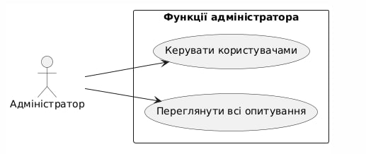

### Діаграма 2: Експерт
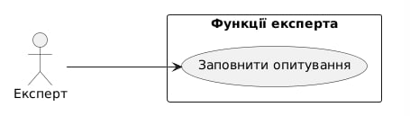

### Діаграма 3: Користувач
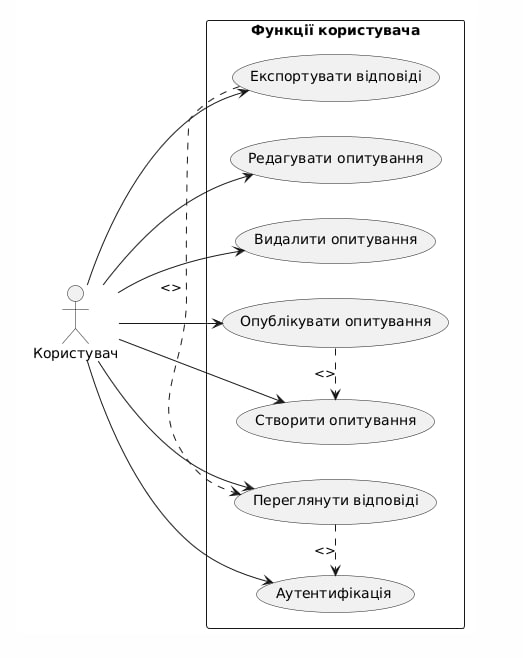

### Діаграма 4: Загальна схема
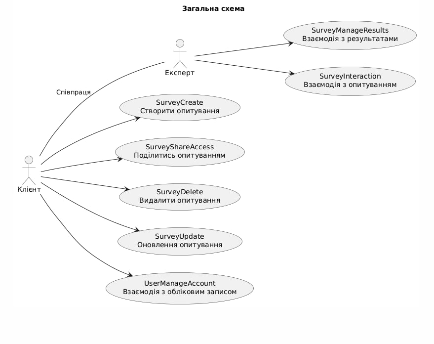

### Діаграма 5: Сценарій використання 
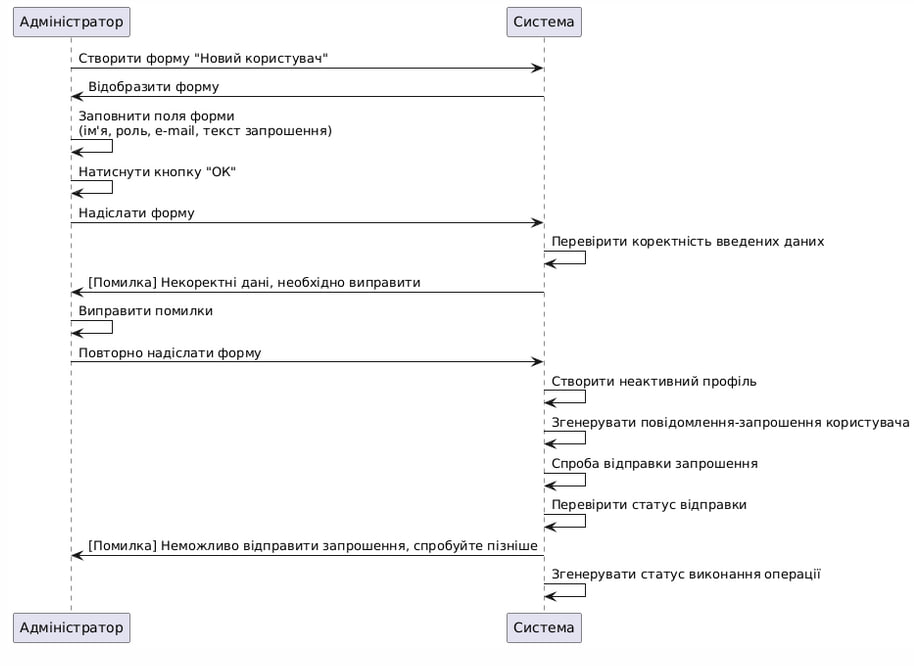

### CreateUser

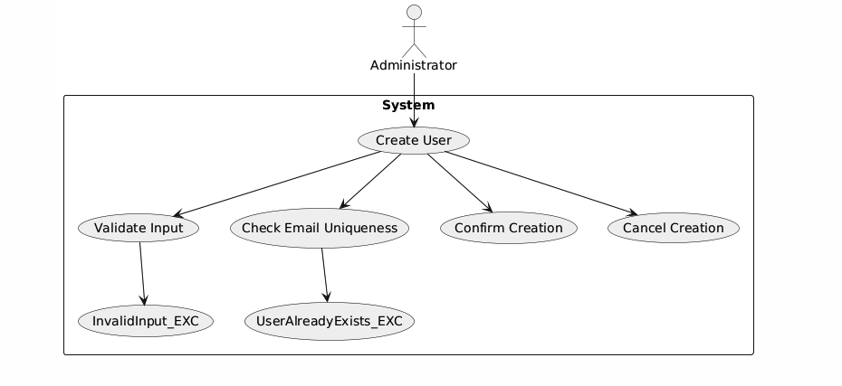

| ID                 | CreateUser                                |
|--------------------|--------------------------------------------|
| **НАЗВА**          | Створити користувача                       |
| **УЧАСНИКИ**       | Адміністратор, система                     |
| **ПЕРЕДУМОВИ**     | – Адміністратор авторизований  – Адміністратор має відповідні права доступу |
| **РЕЗУЛЬТАТ**      | Новий користувач створений у системі       |
| **ВИКЛЮЧНІ СИТУАЦІЇ** | – CreateUser_UserAlreadyExists_EXC – користувач з таким email уже існує  – CreateUser_InvalidInput_EXC – введено некоректні дані  – CreateUser_CancelButton_EXC – адміністратор натиснув "Відміна" |
| **ОСНОВНИЙ СЦЕНАРІЙ** | 1. Адміністратор переходить до розділу "Користувачі" → "Створити користувача". 2. Заповнює форму з необхідними даними (ім’я, email, роль, тощо). 3. Натискає кнопку "Зберегти" (можлива CreateUser_CancelButton_EXC). 4. Система перевіряє унікальність email (можлива CreateUser_UserAlreadyExists_EXC) та валідність даних (можлива CreateUser_InvalidInput_EXC). 5. Система створює нового користувача та відображає повідомлення про успішне створення. |

### ReadUser

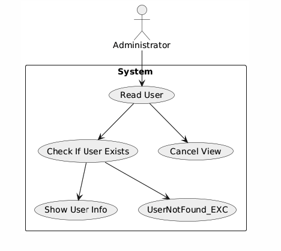

| **ID**               | ReadUser                                          |
|----------------------|---------------------------------------------------|
| **НАЗВА**            | Переглянути користувача                           |
| **УЧАСНИКИ**         | Адміністратор, система                            |
| **ПЕРЕДУМОВИ**       | – Адміністратор авторизований  – Користувач існує в системі |
| **РЕЗУЛЬТАТ**        | Відображено детальну інформацію про користувача   |
| **ВИКЛЮЧНІ СИТУАЦІЇ**| – ReadUser_UserNotFound_EXC – користувач не знайдений  – ReadUser_CancelButton_EXC – адміністратор натиснув "Відміна" |
| **ОСНОВНИЙ СЦЕНАРІЙ**| 1. Адміністратор переходить до розділу "Користувачі". 2. Вибирає потрібного користувача зі списку. 3. Система перевіряє, чи існує користувач (можлива ReadUser_UserNotFound_EXC). 4. Система відображає детальну інформацію про користувача (ПІБ, email, роль, статус, дата створення). 5. Адміністратор переглядає інформацію або повертається назад (можлива ReadUser_CancelButton_EXC). |

### UpdateUser

| **ID**               | UpdateUser                                         |
|----------------------|----------------------------------------------------|
| **НАЗВА**            | Оновити інформацію користувача                     |
| **УЧАСНИКИ**         | Адміністратор, система                             |
| **ПЕРЕДУМОВИ**       | – Адміністратор авторизований  – Користувач існує в системі |
| **РЕЗУЛЬТАТ**        | Інформацію про користувача оновлено в системі      |
| **ВИКЛЮЧНІ СИТУАЦІЇ**| – UpdateUser_UserNotFound_EXC – користувача не знайдено  – UpdateUser_InvalidInput_EXC – недійсні або некоректні дані  – UpdateUser_CancelButton_EXC – адміністратор натиснув "Відміна" |
| **ОСНОВНИЙ СЦЕНАРІЙ**| 1. Адміністратор переходить до розділу "Користувачі". 2. Вибирає користувача для редагування. 3. Система перевіряє, чи існує користувач (можлива UpdateUser_UserNotFound_EXC). 4. Адміністратор редагує дані (ім’я, роль, email, статус тощо). 5. Натискає кнопку "Зберегти" (можлива UpdateUser_CancelButton_EXC). 6. Система перевіряє введені дані (можлива UpdateUser_InvalidInput_EXC). 7. Якщо все коректно — система оновлює дані користувача та повідомляє про успіх. |

### DeleteUser

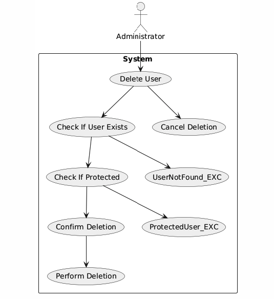

| **ID**               | DeleteUser                                         |
|----------------------|----------------------------------------------------|
| **НАЗВА**            | Видалити користувача                               |
| **УЧАСНИКИ**         | Адміністратор, система                             |
| **ПЕРЕДУМОВИ**       | – Адміністратор авторизований  – Користувач існує в системі |
| **РЕЗУЛЬТАТ**        | Користувача видалено із системи або змінено його статус на "неактивний" |
| **ВИКЛЮЧНІ СИТУАЦІЇ**| – DeleteUser_UserNotFound_EXC – користувач не знайдений  – DeleteUser_ProtectedUser_EXC – спроба видалити критичного системного користувача  – DeleteUser_CancelButton_EXC – адміністратор натиснув "Відміна" |
| **ОСНОВНИЙ СЦЕНАРІЙ**| 1. Адміністратор переходить до розділу "Користувачі". 2. Вибирає користувача для видалення. 3. Система перевіряє наявність користувача (можлива DeleteUser_UserNotFound_EXC). 4. Система перевіряє, чи не є користувач системно критичним (можлива DeleteUser_ProtectedUser_EXC). 5. Адміністратор натискає "Видалити" → підтверджує дію (можлива DeleteUser_CancelButton_EXC). 6. Система видаляє користувача або змінює його статус на "неактивний". 7. Система повідомляє про успішне видалення. |

### AssignRole

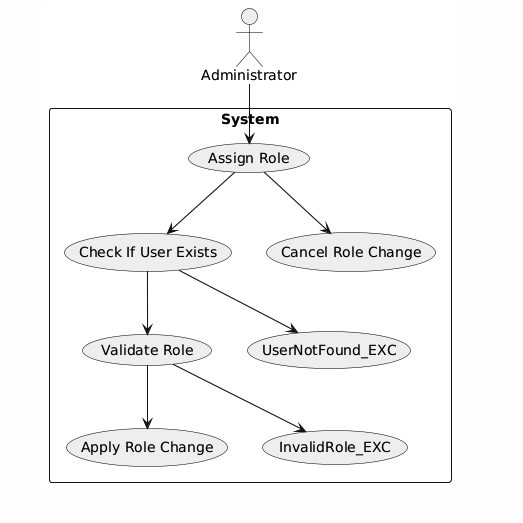

| **ID**               | AssignRole                                        |
|----------------------|----------------------------------------------------|
| **НАЗВА**            | Призначити роль користувачу                        |
| **УЧАСНИКИ**         | Адміністратор, система                             |
| **ПЕРЕДУМОВИ**       | – Адміністратор авторизований  – Користувач існує в системі |
| **РЕЗУЛЬТАТ**        | Користувачу призначено нову роль у системі         |
| **ВИКЛЮЧНІ СИТУАЦІЇ**| – AssignRole_UserNotFound_EXC – користувача не знайдено  – AssignRole_InvalidRole_EXC – обрана недійсна/заборонена роль  – AssignRole_CancelButton_EXC – адміністратор натиснув "Відміна" |
| **ОСНОВНИЙ СЦЕНАРІЙ**| 1. Адміністратор переходить до профілю користувача. 2. Вибирає дію "Призначити роль". 3. Система перевіряє існування користувача (можлива AssignRole_UserNotFound_EXC). 4. Адміністратор обирає роль зі списку (наприклад, "Експерт", "Модератор", "Адміністратор"). 5. Система перевіряє валідність ролі (можлива AssignRole_InvalidRole_EXC). 6. Адміністратор підтверджує зміну ролі (можлива AssignRole_CancelButton_EXC). 7. Система оновлює роль користувача та повідомляє про успішну зміну. |

### CreateSurvey

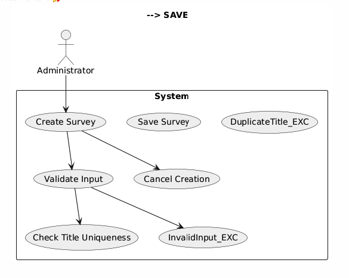

| **ID**               | CreateSurvey                                         |
|----------------------|------------------------------------------------------|
| **НАЗВА**            | Створити опитування                                  |
| **УЧАСНИКИ**         | Адміністратор, система                               |
| **ПЕРЕДУМОВИ**       | – Адміністратор авторизований                        |
| **РЕЗУЛЬТАТ**        | Нове опитування створене та збережене в системі     |
| **ВИКЛЮЧНІ СИТУАЦІЇ**| – CreateSurvey_InvalidInput_EXC – некоректно заповнені поля  – CreateSurvey_DuplicateTitle_EXC – назва опитування вже існує  – CreateSurvey_CancelButton_EXC – адміністратор натиснув "Відміна" |
| **ОСНОВНИЙ СЦЕНАРІЙ**| 1. Адміністратор переходить до розділу "Опитування" → "Створити нове". 2. Заповнює основну інформацію: назва, опис, тип, терміни, налаштування. 3. Додає запитання або натискає "Зберегти як чернетку". 4. Система перевіряє валідність введених даних (можлива CreateSurvey_InvalidInput_EXC). 5. Перевіряє, чи така назва вже існує (можлива CreateSurvey_DuplicateTitle_EXC). 6. Якщо все валідно — зберігає опитування. 7. Виводиться повідомлення про успішне створення. |

### ReadSurvey

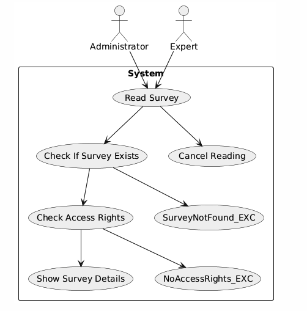

| **ID**               | ReadSurvey                                          |
|----------------------|-----------------------------------------------------|
| **НАЗВА**            | Переглянути опитування                              |
| **УЧАСНИКИ**         | Адміністратор, експерт, система                     |
| **ПЕРЕДУМОВИ**       | – Користувач авторизований  – Має право доступу до опитування |
| **РЕЗУЛЬТАТ**        | Відображено вміст опитування з усіма деталями       |
| **ВИКЛЮЧНІ СИТУАЦІЇ**| – ReadSurvey_SurveyNotFound_EXC – опитування не знайдено  – ReadSurvey_NoAccessRights_EXC – користувач не має прав перегляду  – ReadSurvey_CancelButton_EXC – користувач натиснув "Відміна" |
| **ОСНОВНИЙ СЦЕНАРІЙ**| 1. Користувач переходить у розділ "Опитування". 2. Вибирає потрібне опитування зі списку. 3. Система перевіряє наявність опитування (можлива ReadSurvey_SurveyNotFound_EXC). 4. Система перевіряє права доступу (можлива ReadSurvey_NoAccessRights_EXC). 5. Якщо перевірки успішні — відображає всю доступну інформацію про опитування (назва, опис, статус, питання, дати тощо). 6. Користувач переглядає інформацію або натискає "Назад" (можлива ReadSurvey_CancelButton_EXC). |

### UpdateSurvey

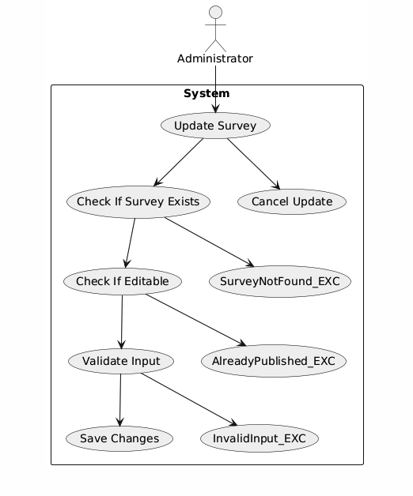

| **ID**               | UpdateSurvey                                         |
|----------------------|------------------------------------------------------|
| **НАЗВА**            | Оновити опитування                                   |
| **УЧАСНИКИ**         | Адміністратор, система                               |
| **ПЕРЕДУМОВИ**       | – Адміністратор авторизований  – Опитування існує  – Опитування ще не опубліковане |
| **РЕЗУЛЬТАТ**        | Збережено зміни до опитування                        |
| **ВИКЛЮЧНІ СИТУАЦІЇ**| – UpdateSurvey_SurveyNotFound_EXC – опитування не знайдено  – UpdateSurvey_AlreadyPublished_EXC – опитування вже опубліковано, редагування заборонене  – UpdateSurvey_InvalidInput_EXC – некоректні дані  – UpdateSurvey_CancelButton_EXC – адміністратор натиснув "Відміна" |
| **ОСНОВНИЙ СЦЕНАРІЙ**| 1. Адміністратор відкриває опитування для редагування. 2. Система перевіряє наявність опитування (можлива UpdateSurvey_SurveyNotFound_EXC). 3. Система перевіряє статус (можлива UpdateSurvey_AlreadyPublished_EXC). 4. Адміністратор змінює заголовок, опис, дати, запитання тощо. 5. Натискає "Зберегти" (можлива UpdateSurvey_CancelButton_EXC). 6. Система перевіряє дані (можлива UpdateSurvey_InvalidInput_EXC). 7. У разі успіху — опитування оновлюється. |

### DeleteSurvey

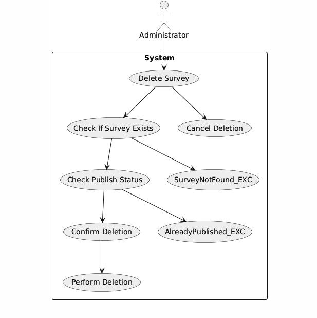

| **ID**               | DeleteSurvey                                         |
|----------------------|------------------------------------------------------|
| **НАЗВА**            | Видалити опитування                                  |
| **УЧАСНИКИ**         | Адміністратор, система                               |
| **ПЕРЕДУМОВИ**       | – Адміністратор авторизований  – Опитування існує |
| **РЕЗУЛЬТАТ**        | Опитування видалено або позначено як "архівоване"    |
| **ВИКЛЮЧНІ СИТУАЦІЇ**| – DeleteSurvey_SurveyNotFound_EXC – опитування не знайдено  – DeleteSurvey_AlreadyPublished_EXC – опубліковане опитування не можна видалити  – DeleteSurvey_CancelButton_EXC – адміністратор натиснув "Відміна" |
| **ОСНОВНИЙ СЦЕНАРІЙ**| 1. Адміністратор переходить у список опитувань. 2. Обирає опитування для видалення. 3. Система перевіряє, чи існує опитування (можлива DeleteSurvey_SurveyNotFound_EXC). 4. Система перевіряє, чи не було воно вже опубліковане (можлива DeleteSurvey_AlreadyPublished_EXC). 5. Адміністратор натискає "Видалити" та підтверджує дію (можлива DeleteSurvey_CancelButton_EXC). 6. Система видаляє або архівує опитування. 7. Відображається повідомлення про успішне видалення. |

### PublishSurvey

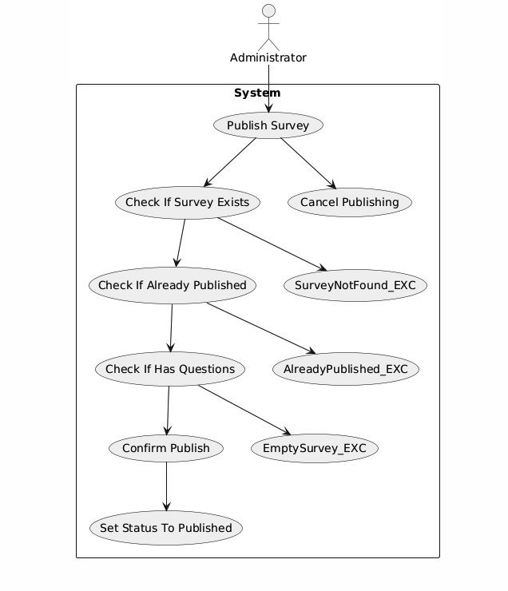

| **ID**               | PublishSurvey                                          |
|----------------------|--------------------------------------------------------|
| **НАЗВА**            | Опублікувати опитування                                |
| **УЧАСНИКИ**         | Адміністратор, система                                 |
| **ПЕРЕДУМОВИ**       | – Адміністратор авторизований  – Опитування збережене та ще не опубліковане  – Є хоча б одне запитання |
| **РЕЗУЛЬТАТ**        | Опитування доступне для проходження                    |
| **ВИКЛЮЧНІ СИТУАЦІЇ**| – PublishSurvey_SurveyNotFound_EXC – опитування не знайдено  – PublishSurvey_AlreadyPublished_EXC – опитування вже опубліковане  – PublishSurvey_EmptySurvey_EXC – в опитуванні немає запитань  – PublishSurvey_CancelButton_EXC – адміністратор натиснув "Відміна" |
| **ОСНОВНИЙ СЦЕНАРІЙ**| 1. Адміністратор відкриває опитування. 2. Система перевіряє, чи воно існує (можлива PublishSurvey_SurveyNotFound_EXC). 3. Система перевіряє, чи не опубліковане вже (можлива PublishSurvey_AlreadyPublished_EXC). 4. Система перевіряє, чи є хоча б одне запитання (можлива PublishSurvey_EmptySurvey_EXC). 5. Адміністратор натискає "Опублікувати" (можлива PublishSurvey_CancelButton_EXC). 6. Система оновлює статус на "Опубліковано". 7. Опитування стає доступним для експертів. |

 

