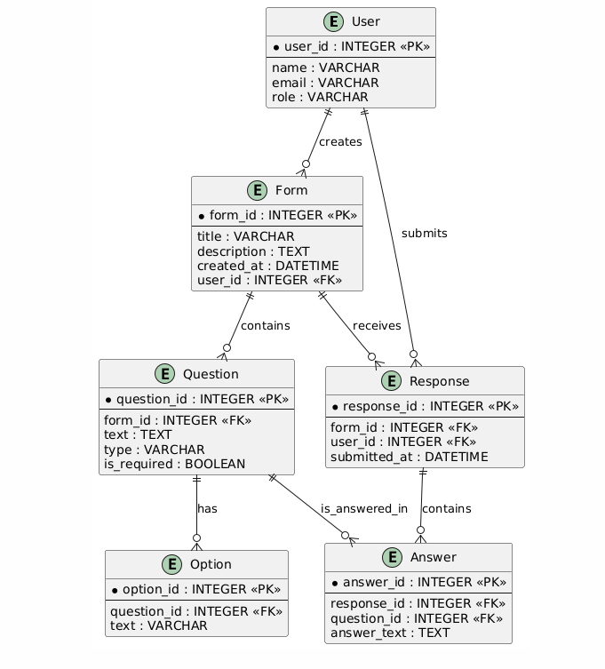

# Реляційна схема
### Форма (`forms`)
| Поле           | Тип даних      | Ключ         |
|----------------|----------------|--------------|
| id             | SERIAL         | PRIMARY KEY  |
| title          | VARCHAR(200)   | NOT NULL     |
| description    | TEXT           |              |
| created_at     | TIMESTAMP      | DEFAULT NOW()|

### Питання (`questions`)
| Поле           | Тип даних      | Ключ         |
|----------------|----------------|--------------|
| id             | SERIAL         | PRIMARY KEY  |
| form_id        | INT            | FOREIGN KEY  |
| question_text  | VARCHAR(500)   | NOT NULL     |
| question_type  | VARCHAR(50)    | NOT NULL     |
| is_required    | BOOLEAN        | DEFAULT FALSE|

### Option (для питань типу "вибір")
| Назва поля | Тип даних  | Ключ          |
|------------|------------|---------------|
| option_id  | INTEGER    | PRIMARY KEY   |
| question_id| INTEGER    | FK → Question |
| text       | VARCHAR    |               |

### Відповіді (`responses`)
| Поле           | Тип даних      | Ключ         |
|----------------|----------------|--------------|
| id             | SERIAL         | PRIMARY KEY  |
| form_id        | INT            | FOREIGN KEY  |
| submitted_at   | TIMESTAMP      | DEFAULT NOW()|

### Відповіді на питання (`answers`)
| Поле           | Тип даних      | Ключ         |
|----------------|----------------|--------------|
| id             | SERIAL         | PRIMARY KEY  |
| response_id    | INT            | FOREIGN KEY  |
| question_id    | INT            | FOREIGN KEY  |
| content        | TEXT           |              |

### SQL-таблиці (DDL)

```sql
CREATE TABLE User (
  user_id INTEGER PRIMARY KEY,
  name VARCHAR(100),
  email VARCHAR(100) UNIQUE,
  role VARCHAR(50)
);

CREATE TABLE Form (
  form_id INTEGER PRIMARY KEY,
  title VARCHAR(255),
  description TEXT,
  created_at DATETIME DEFAULT CURRENT_TIMESTAMP,
  user_id INTEGER,
  FOREIGN KEY (user_id) REFERENCES User(user_id)
);

CREATE TABLE Question (
  question_id INTEGER PRIMARY KEY,
  form_id INTEGER,
  text TEXT,
  type VARCHAR(50),
  is_required BOOLEAN,
  FOREIGN KEY (form_id) REFERENCES Form(form_id)
);

CREATE TABLE Option (
  option_id INTEGER PRIMARY KEY,
  question_id INTEGER,
  text VARCHAR(255),
  FOREIGN KEY (question_id) REFERENCES Question(question_id)
);

CREATE TABLE Response (
  response_id INTEGER PRIMARY KEY,
  form_id INTEGER,
  user_id INTEGER,
  submitted_at DATETIME DEFAULT CURRENT_TIMESTAMP,
  FOREIGN KEY (form_id) REFERENCES Form(form_id),
  FOREIGN KEY (user_id) REFERENCES User(user_id)
);

CREATE TABLE Answer (
  answer_id INTEGER PRIMARY KEY,
  response_id INTEGER,
  question_id INTEGER,
  answer_text TEXT,
  FOREIGN KEY (response_id) REFERENCES Response(response_id),
  FOREIGN KEY (question_id) REFERENCES Question(question_id)
);
```

## Зв'язки (UML)
